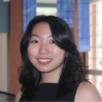

# Shudan Jew

### About Me
I am a passionate and driven researcher- with a focus on using bioinformatics to make sense of large and complex biological data sets.

### Education

**Loyola University Maryland**  
*BSc in Biohealth, concentration in Biotech and Biopharma*  
*Hauber Research Fellow*  
Supervised by Dr. Cassandra Holbert  

**Institute of Marine and Environmental Technology**  
*Research Assistant*  
Mentored by Anne Baldino and Dr. Tsvetan Bachvaroff  

### Projects

#### Exploratory Gene Expresssion Analysis
- 

***
#### Differential Gene Expression & Visualization
- 
- Write-up here

***
#### Bioinformatics Capstone: Cachexia Induced Differential Gene Expression in Zebrafish
- 

***  

#### The Effect of Isotretinoin on Neuroblastoma 
- Chi Nguyen and Shudan Jew  
- Sponsored by Jackson Laboratory  
